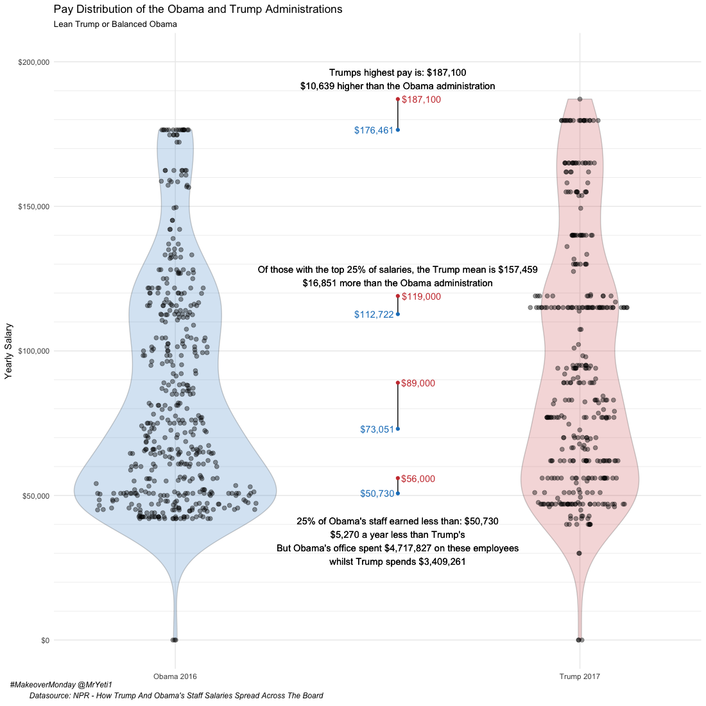
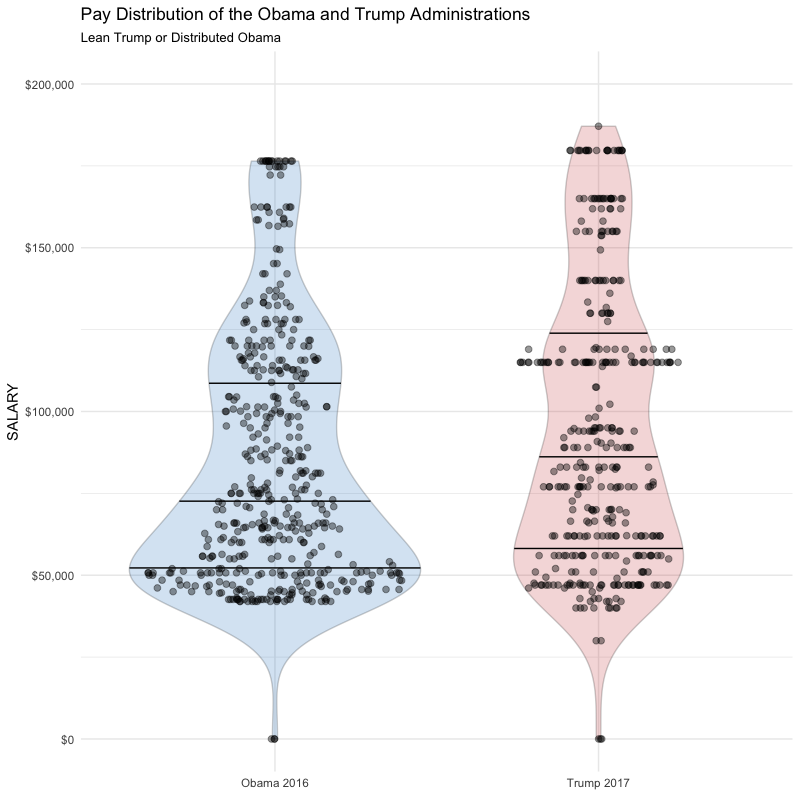

# #MakeoverMonday White House Pay Distributions between Obama and Trump Administrations

[#MakeoverMonday](http://www.makeovermonday.co.uk/) week 29.
Datasource from [NPR - How Trump And Obama’s Staff Salaries Spread Across The Board](http://www.npr.org/2017/06/30/535069910/trump-white-house-staff-payroll-nearly-36-million-and-top-heavy)

Fantastic to be included in the weekly writeup http://www.makeovermonday.co.uk/week-29/

## Second (posted) Iteration

## First (posted) Iteration

